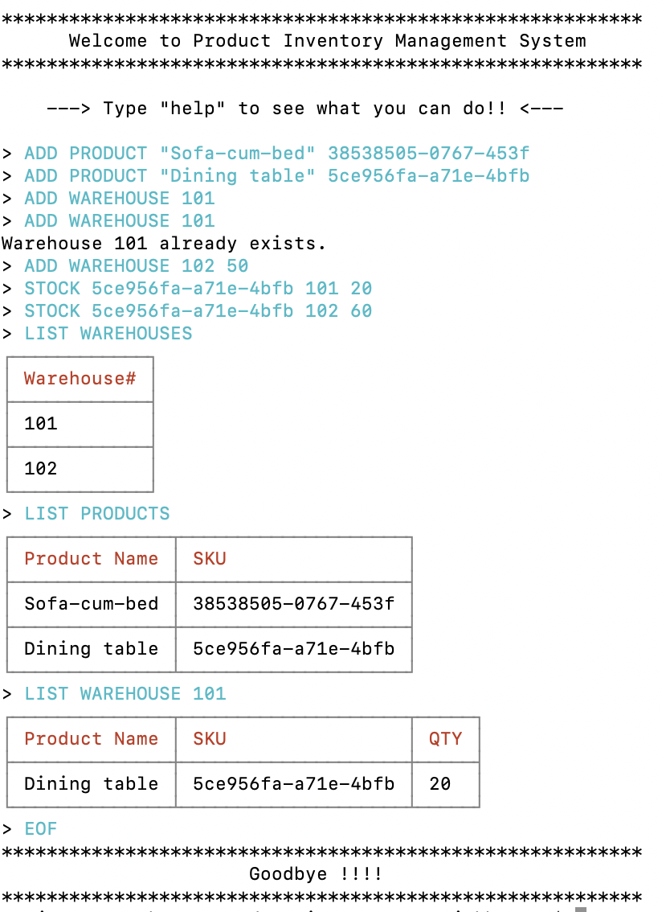

# Product Inventory Management System
A simple REPL CLI application to manage products in the inventory. 
## How to use this repository?
1. Clone the repository.

2. `npm install` to get all packages. 

3. `npm start` to start a new CLI session. 

4. Type `EOF` in the CLI to quit the session. 

## Commands Supported 
1. **ADD PRODUCT**  "PRODUCT NAME"  SKU

2. **ADD WAREHOUSE**  WAREHOUSE#  [STOCK_LIMIT]

3. **STOCK** SKU  WAREHOUSE#  QTY

4. **UNSTOCK**  SKU  WAREHOUSE#  QTY

5. **LIST PRODUCTS**

6. **LIST WAREHOUSES**

7. **LIST WAREHOUSE** WAREHOUSE#

## Command History

All the commands issued in a session are stored in the `log.txt` file asynchronously (in batches of 2) i.e. If a user types in two commands we want those two to be in the same batch, if they type 3 commands stream the first two and wait for the fourth command.

## Example Session

